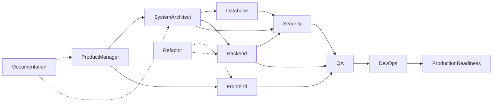

# Agent Coordination

## Mission

Coordinate ObraTech AI agents for FundTrack so documentation and (later) implementation stay gated, traceable, and non-conflicting.

## Handoff Flow

## Rules

1. No agent begins application coding until Gate 4 (Gates 1–3 approved).
2. Conflicts → record in `planning/open-questions.md` or a change request.
3. Security Agent may veto designs that expose service role or weaken RLS.
4. Documentation Agent keeps cross-links and glossary consistent.
5. Frontend Agent owns [docs/28-ui-design-system.md](../docs/28-ui-design-system.md).

## Phase ownership (summary)

| Phase | Lead agents |
| --- | --- |
| 0–2 | PM, Architect, DB, Security, Docs, Frontend (UX docs) |
| 3–6 | FE, BE, DB, Security (implementation — future) |
| 7–8 | QA, Sec, DevOps, Production Readiness |

## Related

- [docs/27-approval-gates.md](../docs/27-approval-gates.md)
- All files in this `agents/` folder
