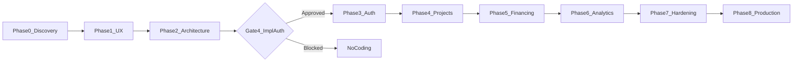

# FundTrack — Master Documentation Index

**Product:** FundTrack – Project Financing and Profit Monitoring System  
**Owner:** ObraTech  
**Supabase (dev):** `jxwvvytzkvtjgtefmxkk`  
**Coding status:** **AUTHORIZED** (Gates 1–4 approved 2026-07-23; Gate 5 production go-live still NOT APPROVED)

## Phase flow

## Product and requirements

| Doc | Title |
| --- | --- |
| [01](01-project-brief.md) | Project brief |
| [02](02-business-story.md) | Business story |
| [03](03-mvp-scope.md) | MVP scope |
| [04](04-user-roles-and-permissions.md) | Roles and permissions |
| [05](05-user-stories.md) | User stories |
| [06](06-business-rules.md) | Business rules |
| [07](07-financial-calculations.md) | Financial calculations |
| [08](08-project-status-workflow.md) | Project status workflow |

## UX and UI

| Doc | Title |
| --- | --- |
| [09](09-page-map-and-user-flows.md) | Page map and user flows |
| [28](28-ui-design-system.md) | UI design system (shadcn/ui) |

## Architecture, data, security

| Doc | Title |
| --- | --- |
| [10](10-system-architecture.md) | System architecture |
| [11](11-database-design.md) | Database design |
| [12](12-data-dictionary.md) | Data dictionary |
| [13](13-authentication-design.md) | Authentication design |
| [14](14-security-plan.md) | Security plan |
| [15](15-row-level-security-plan.md) | RLS plan |

## Quality and operations

| Doc | Title |
| --- | --- |
| [16](16-testing-plan.md) | Testing plan |
| [17](17-deployment-plan.md) | Deployment plan (Vercel-ready) |
| [18](18-backup-and-recovery.md) | Backup and recovery |
| [19](19-monitoring-and-observability.md) | Monitoring |
| [20](20-production-readiness.md) | Production readiness |
| [23](23-risk-register.md) | Risk register |

## Guides and governance

| Doc | Title |
| --- | --- |
| [21](21-admin-user-guide-outline.md) | Admin guide outline |
| [22](22-financier-user-guide-outline.md) | Financier guide outline |
| [24](24-assumptions-and-constraints.md) | Assumptions and constraints |
| [25](25-glossary.md) | Glossary |
| [26](26-traceability-matrix.md) | Traceability matrix |
| [27](27-approval-gates.md) | Approval gates |

## Other folders

- [agents/](../agents/) — ObraTech AI agent specs  
- [phases/](../phases/) — Phase 00–08  
- [decisions/](../decisions/) — ADRs  
- [templates/](../templates/) — Story/test/approval templates  
- [planning/](../planning/) — Backlogs and open questions  
