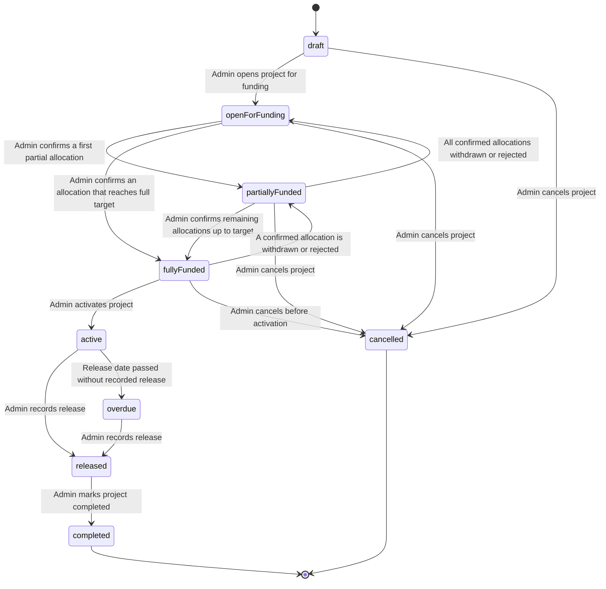

# FundTrack — Project Status Workflow

## Document Control

| Field | Value |
| --- | --- |
| Document | `docs/08-project-status-workflow.md` |
| Owner | ObraTech |
| Product | FundTrack — Project Financing and Profit Monitoring System |
| Version | 0.1 |
| Last Updated | 2026-07-23 |
| Approval Status | **READY FOR REVIEW** |

## 1. Purpose

This document defines the complete lifecycle of a FundTrack project: every status a project can be in, the conditions that trigger a transition between statuses, who is authorized to trigger each transition, which transitions are explicitly prohibited, and how each status affects whether commitments can be edited and whether a release may be recorded.

This workflow is the authoritative reference for [docs/05-user-stories.md](05-user-stories.md), [docs/06-business-rules.md](06-business-rules.md) (Sections 4, 7, 8, and 12), and [docs/07-financial-calculations.md](07-financial-calculations.md).

> **Relationship to the release event sub-workflow:** [docs/03-mvp-scope.md](03-mvp-scope.md) describes a separate, simpler sub-state machine for the release event itself (**TBA → Scheduled → Released**, with a computed **Overdue** flag). The `Released` and `Overdue` project statuses defined below are the project-level reflection of that same release event: when the release event is posted as `Released`, the project status becomes `Released`; when a `Scheduled` release event's date passes unposted, the project status becomes `Overdue`. The two views describe the same underlying event from different levels of the data model.

## 2. Status Definitions

| Status | Meaning |
| ------ | ------- |
| **Draft** | The project has been created by an admin but is not yet visible to financiers. All core fields, including the Target Funding Amount, remain fully editable. |
| **Open for Funding** | The project is visible to invited financiers, who may submit willing contribution amounts. No amount has been confirmed yet, or confirmations have not yet reached the target. |
| **Partially Funded** | At least one commitment has been `Confirmed`, and the total Confirmed Amount is less than the Target Funding Amount. |
| **Fully Funded** | The total Confirmed Amount equals the Target Funding Amount (Remaining Gap = ₱0.00). No further confirmations are accepted. |
| **Active** | An admin has activated the fully funded project. Capital is considered deployed; all confirmed commitments are locked and can no longer be withdrawn through self-service. |
| **Overdue** | System-derived. The project's Release Date has passed (evaluated in the `Asia/Manila` timezone) while the project was `Active`, and no release has yet been recorded. |
| **Released** | An admin has recorded the release event: capital and profit distributions have been computed and posted for every financier. |
| **Completed** | An admin has reconciled and formally closed out the project after release. Terminal status. |
| **Cancelled** | An admin has terminated the project before activation. Terminal status. |

## 3. State Diagram

Node identifiers use camelCase with no spaces or special characters, per project documentation conventions.

## 4. Status Transition Table

| Status | Who Can Change Into It | Entry Condition | Commitments Editable? | Releases Allowed? | Permitted Exit Transitions |
| ------ | ----------------------- | ---------------- | :---------------------: | :------------------: | ---------------------------- |
| Draft | Admin | Project record created | Yes — no financiers invited yet, or invited but not yet acted upon | No | → Open for Funding, → Cancelled |
| Open for Funding | Admin | Admin opens the project; financiers may be invited and submit willing amounts | Yes — Submitted amounts remain editable by financiers; no Confirmed amounts exist yet | No | → Partially Funded, → Fully Funded, → Cancelled |
| Partially Funded | System (derived) | At least one commitment `Confirmed`; total Confirmed Amount < Target | Other financiers' Submitted amounts remain editable; Confirmed amounts are locked to financier self-service (admin may still adjust, subject to audit) | No | → Fully Funded, → Open for Funding, → Cancelled |
| Fully Funded | System (derived) | Total Confirmed Amount = Target Funding Amount | No new confirmations accepted (Remaining Gap = ₱0.00); existing Confirmed amounts may only be withdrawn via admin action | No | → Active, → Partially Funded, → Cancelled |
| Active | Admin | Admin activates a Fully Funded project | No — all commitments are locked | No — awaiting the Release Date | → Released, → Overdue |
| Overdue | System (derived) | Release Date passed (Asia/Manila) with no release recorded, project was Active | No | Yes — recording a release is the required corrective action | → Released |
| Released | Admin | Admin records the release (from Active or Overdue) | No | No — release has already been recorded (one-time event) | → Completed |
| Completed | Admin | Admin reconciles and formally closes the project after release | No | No | *(none — terminal)* |
| Cancelled | Admin | Admin cancels the project before activation | No | No | *(none — terminal)* |

## 5. Prohibited Transitions

The following transitions are explicitly disallowed and must be rejected server-side regardless of any client-side state:

| From | To | Reason Prohibited |
| ---- | -- | ------------------ |
| Draft | Active, Released, Completed, Overdue | Must progress through the funding stages and be explicitly activated before becoming Active; cannot skip funding entirely. |
| Open for Funding | Active, Released, Completed, Overdue | Must first reach Fully Funded before activation. |
| Partially Funded | Active, Released, Completed, Overdue | Must first reach Fully Funded before activation. |
| Fully Funded | Released, Completed, Overdue | Must first be explicitly activated by an admin; Overdue and Released only apply once a project is Active. |
| Active | Draft, Open for Funding, Partially Funded, Fully Funded | Once capital is deployed (Active), the project can never revert to a pre-funding stage. |
| Active | Cancelled | Once Active, capital has already been committed and deployed; cancellation is no longer available. Any exceptional wind-down is handled outside this workflow (out of scope for MVP). |
| Active | Completed | Cannot skip directly to Completed without first passing through a recorded Release. |
| Overdue | Any status other than Released | The only corrective action from Overdue is to record the release; the project cannot silently revert to Active, nor be cancelled. |
| Released | Any status other than Completed | Once a release has been recorded, funding cannot be reopened, the project cannot be reactivated, and it cannot be cancelled. |
| Completed | Any status | Terminal status; no further transitions are permitted. |
| Cancelled | Any status | Terminal status; no further transitions are permitted. |

## 6. Timezone Rule for Overdue Detection

- All date/time comparisons used to determine `Overdue` status — specifically, comparing the current date against a project's Release Date — **must** be evaluated in the **`Asia/Manila`** timezone (UTC+8), regardless of the underlying database server's timezone configuration, the timezone of any scheduled job runner, or the local timezone of the admin's or financier's browser.
- A project becomes `Overdue` at the first moment that the current Asia/Manila calendar date is strictly later than the project's Release Date, provided the project is `Active` and no release has been recorded.
- The number of "days overdue" displayed to users (see [US-009, US-013](05-user-stories.md)) is likewise computed as the difference between the current Asia/Manila date and the Release Date, in whole days.
- This rule exists because FundTrack's financiers and administrators operate in the Philippines; using a server's default UTC clock (or any other timezone) could cause a project to appear overdue up to a day early or late relative to local business expectations, undermining trust in the platform's release tracking (see [docs/01-project-brief.md](01-project-brief.md), [ADR-001](../decisions/ADR-001-technology-stack.md)).
- The Overdue evaluation may be implemented as a scheduled recurring check and/or computed live on read; either approach must apply the Asia/Manila rule consistently, and the resulting status transition (when it occurs via the scheduled check) is recorded in the audit log with actor `system` (see [BR-049, BR-057](06-business-rules.md)).

## 7. Approval Status

**Status: READY FOR REVIEW**

This workflow should be approved (using [templates/approval-record-template.md](../templates/approval-record-template.md)) before the `projects.status` enum, its associated database constraints, and the scheduled Overdue check are implemented.

## 8. Related Documents

- [docs/01-project-brief.md](01-project-brief.md) — Product identity and goals
- [docs/03-mvp-scope.md](03-mvp-scope.md) — Release event sub-states (TBA/Scheduled/Released) referenced in Section 1
- [docs/05-user-stories.md](05-user-stories.md) — Stories that trigger these transitions
- [docs/06-business-rules.md](06-business-rules.md) — Business rules underlying Sections 4 and 5
- [docs/07-financial-calculations.md](07-financial-calculations.md) — Formulas computed at the Fully Funded and Released transitions
- [ADR-001](../decisions/ADR-001-technology-stack.md) — Timezone and currency defaults
- [ADR-005](../decisions/ADR-005-entity-consolidation.md) — Schema shape behind commitment and release records
