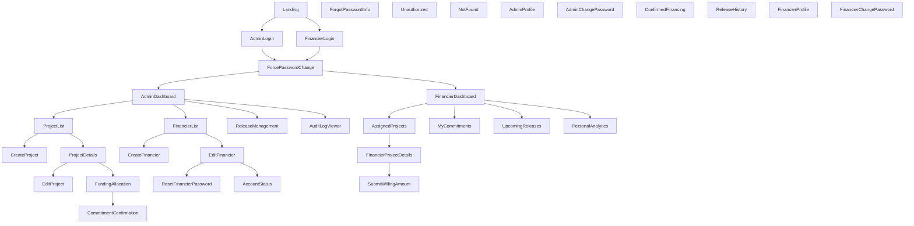
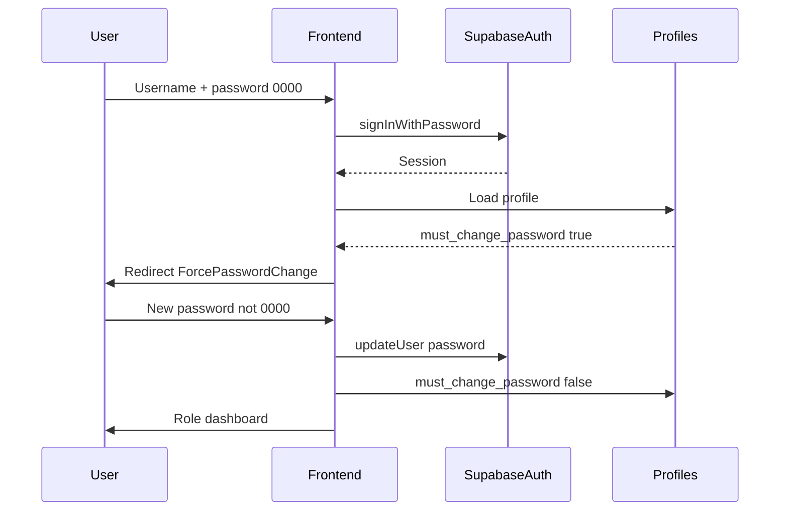
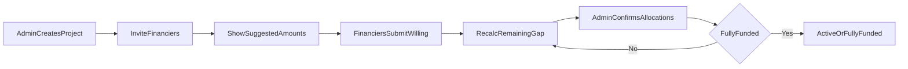
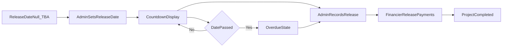

# FundTrack — Page Map and User Flows

## Document Control

| Field | Value |
| --- | --- |
| Document | `docs/09-page-map-and-user-flows.md` |
| Owner | ObraTech |
| Version | 0.1 |
| Last Updated | 2026-07-23 |
| Approval Status | **READY FOR REVIEW** |

## 1. Purpose

Inventories all MVP pages, navigation, and primary user flows. Wireframe-level section descriptions only — no UI code. Component mapping references [docs/28-ui-design-system.md](28-ui-design-system.md).

## 2. Site Map

## 3. Public Pages

| Route (planned) | Page | Sections | Primary components |
| --- | --- | --- | --- |
| `/` | Landing | Brand, short product pitch, CTAs to Admin / Financier login | Button, Card |
| `/login/admin` | Admin login | Username, password, submit, link to forgot-password info | Form, Input, PasswordInput, Button, Label |
| `/login/financier` | Financier login | Same as admin login | Form, Input, PasswordInput, Button |
| `/change-password` | Mandatory first-login password change | Current/temp password, new password, confirm | Form, PasswordInput, Alert, Button |
| `/forgot-password` | Forgot / reset info | Explains admin-assisted reset for MVP | Card, Alert |
| `/unauthorized` | Unauthorized | Message + return home | Alert, Button |
| `/404` | Not found | Message + return home | EmptyState, Button |

## 4. Administrator Pages

| Route (planned) | Page | Sections | Primary components |
| --- | --- | --- | --- |
| `/admin` | Dashboard | KPI cards, charts, upcoming/overdue releases, awaiting confirmation | Card, Badge, Chart, Skeleton, Sidebar |
| `/admin/projects` | Project list | Filters by status, search, table, create CTA | DataTable, Badge, Button, Select |
| `/admin/projects/new` | Create project | Core fields form | Form, Input, DatePicker, Textarea, Select |
| `/admin/projects/:id` | Project details | Summary, financiers table, funding progress, releases | Tabs, Progress, DataTable, Badge |
| `/admin/projects/:id/edit` | Edit project | Editable fields by status rules | Form, Alert |
| `/admin/projects/:id/funding` | Funding allocation | Suggested vs willing vs confirmed, gap | DataTable, Progress, Badge |
| `/admin/projects/:id/confirm` | Commitment confirmation | Confirm dialog, amounts, reconciliation note | Dialog, ConfirmationAlert, Input |
| `/admin/financiers` | Financier list | Status, search, create | DataTable, Badge, Avatar |
| `/admin/financiers/new` | Create financier | Profile + username | Form, Input |
| `/admin/financiers/:id` | Edit financier | Profile, status, reset password | Tabs, Form, Dialog |
| `/admin/releases` | Release management | TBA / scheduled / overdue / released | DataTable, DatePicker, Dialog |
| `/admin/audit` | Audit log viewer | Filters, immutable event list | DataTable, Select |
| `/admin/profile` | Admin profile | Name, username | Form |
| `/admin/change-password` | Change password | Standard change | Form, PasswordInput |

Layout: desktop Sidebar + Breadcrumbs; mobile Sheet drawer. See design system.

## 5. Financier Pages

| Route (planned) | Page | Sections | Primary components |
| --- | --- | --- | --- |
| `/app` | Dashboard | Personal KPIs, nearest release, charts | Card, Chart, Badge |
| `/app/projects` | Assigned / available projects | List with status and suggested amount | DataTable, Badge |
| `/app/projects/:id` | Project details (own view) | Own amounts only, countdown, profit preview | Card, Progress, Badge |
| `/app/projects/:id/commit` | Submit willing amount | Suggested, remaining gap, willing input | Form, Input, Alert |
| `/app/commitments` | My commitments | Status badges | DataTable |
| `/app/confirmed` | Confirmed financing | Confirmed %, profit, total receivable | DataTable |
| `/app/releases/upcoming` | Upcoming releases | Countdown copy rules | DataTable, Badge |
| `/app/releases/history` | Release history | Payments received | DataTable |
| `/app/analytics` | Personal analytics | Charts + metric cards | Chart, Card |
| `/app/profile` | Profile | Contact fields | Form |
| `/app/change-password` | Change password | Standard | Form, PasswordInput |

## 6. Key User Flows

### 6.1 First login / forced password change

### 6.2 Flexible financing

### 6.3 Release workflow

## 7. Navigation Rules

- Unauthenticated users only reach public pages.
- `must_change_password = true` blocks all app routes except change-password and logout.
- Admin routes require `profiles.role = admin`.
- Financier routes require `profiles.role = financier` and active account.
- Cross-role URL access → Unauthorized page.

## 8. Accessibility and Responsive Notes

- All forms labeled; errors associated with fields.
- Tables scroll horizontally on small screens; critical actions remain reachable.
- Sidebar collapses to Sheet on mobile breakpoints.
- Focus traps in Dialogs; Escape closes non-destructive dialogs.

## 9. Related Documents

- [docs/05-user-stories.md](05-user-stories.md)
- [docs/08-project-status-workflow.md](08-project-status-workflow.md)
- [docs/28-ui-design-system.md](28-ui-design-system.md)
- [docs/04-user-roles-and-permissions.md](04-user-roles-and-permissions.md)
