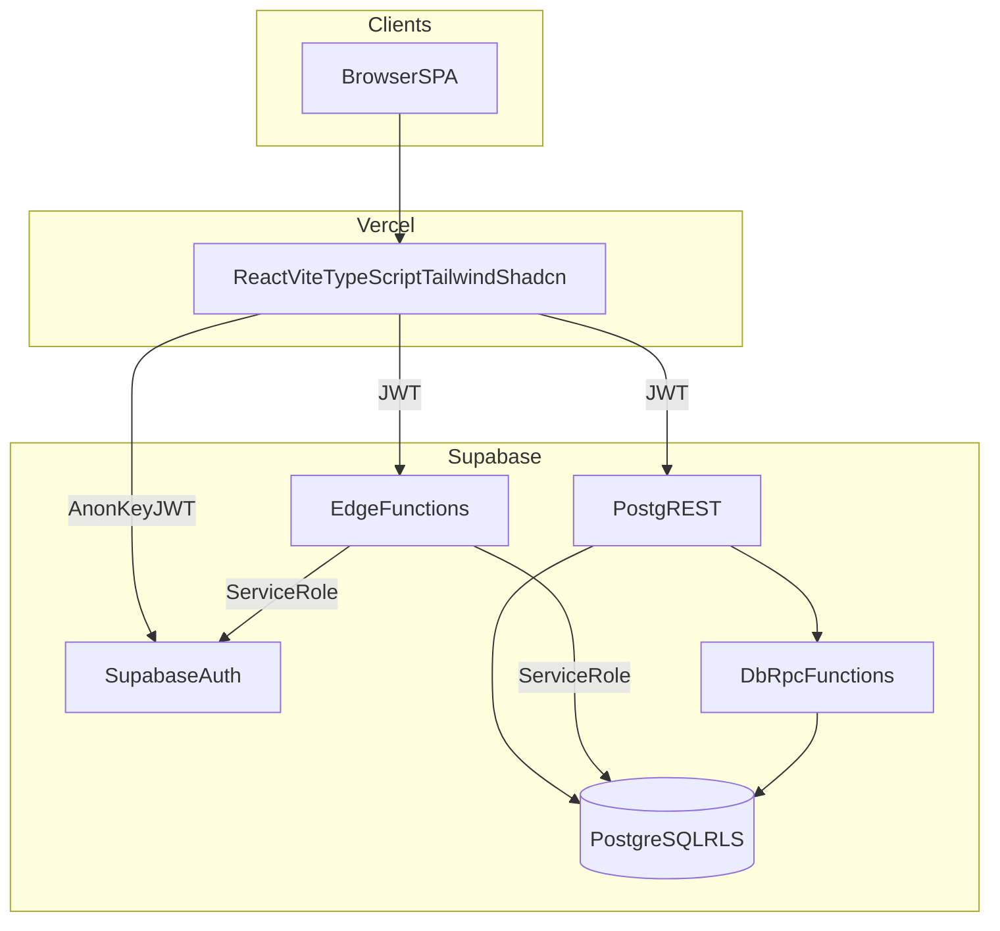

# FundTrack — System Architecture

## Document Control

| Field | Value |
| --- | --- |
| Document | `docs/10-system-architecture.md` |
| Owner | ObraTech |
| Version | 0.1 |
| Last Updated | 2026-07-23 |
| Approval Status | **READY FOR REVIEW** |

## 1. Overview

FundTrack is a private SPA on **Vercel** backed by **Supabase** (Auth, PostgreSQL, RLS, Edge Functions). Dev target project: `jxwvvytzkvtjgtefmxkk`.

## 2. Technology Boundaries

| Layer | Responsibility |
| --- | --- |
| Frontend (Vercel) | UX, forms, previews, charts, route guards, call Supabase client / Edge Functions |
| Supabase Auth | Password hashing, sessions, JWT |
| PostgreSQL + RLS | Data, constraints, authoritative money math via RPC |
| Edge Functions | Privileged Auth Admin API ops; orchestrated confirmations when needed |
| Vercel env | `VITE_SUPABASE_URL`, `VITE_SUPABASE_ANON_KEY` only in frontend |

## 3. Answers to Architecture Questions

1. **Frontend calculations:** Display previews (suggested amount, countdown copy, chart formatting). Never authoritative for confirmation or profit.
2. **Server/DB validation:** Willing amount bounds, sum(confirmed) ≤ capital, status transitions, percentages, profit shares, release allocations — via constraints + RPC.
3. **Edge Functions required:** Create financier Auth user, reset password + revoke sessions, unlock/deactivate if Auth Admin needed, optional confirm-allocations orchestration.
4. **Admin creates financier:** Edge Function verifies caller is admin → Auth Admin createUser with synthetic email + password `0000` → insert `profiles` with `must_change_password=true` → audit + security event.
5. **Forced password change:** Profile flag + frontend route gate + optional RLS/RPC denying business writes until false; password update via Auth `updateUser`.
6. **Service-role security:** Stored only in Edge Function secrets / Supabase function env — never in Vercel `VITE_*` or git.
7. **RLS:** Financiers read/update only own profile rows and own `project_financiers` rows; admins full access; audit logs append-only for clients.
8. **Concurrent overfunding:** Confirmation inside a transaction with row locks / `SELECT … FOR UPDATE` on project; check sum ≤ capital; reject with error if race loses.
9. **Allocation confirmation:** Single transactional RPC (or Edge→RPC) updating all confirmed amounts, statuses, project funding status, audit rows.
10. **Rounding:** `NUMERIC(18,2)`; one-centavo adjustment on last allocation; audit the adjustment ([ADR-003](../decisions/ADR-003-money-precision.md)).
11. **Countdowns:** Compute in Asia/Manila (`Asia/Manila`) comparing calendar dates for release vs “today”.
12. **Audit events:** Trigger or explicit inserts from RPCs/Edge for create/update/confirm/reset/release.
13. **Deactivated users:** Soft status on profiles; historical `project_financiers` and payments retained; login blocked.
14. **Backups/DR:** Supabase managed backups + documented PITR/export strategy in [docs/18-backup-and-recovery.md](18-backup-and-recovery.md).

## 4. Environment Strategy

| Env | Frontend | Database |
| --- | --- | --- |
| Local | Vite dev | Supabase project `jxwvvytzkvtjgtefmxkk` (or local CLI later) |
| Staging | Vercel preview / staging deploy | Separate staging Supabase project (recommended) |
| Production | Vercel production | Production Supabase project |

## 5. Error Handling and Monitoring

- Edge Functions return structured error codes without leaking internals.
- Frontend maps codes to toast / form errors.
- Observability plan: [docs/19-monitoring-and-observability.md](19-monitoring-and-observability.md).

## 6. Related ADRs

- [ADR-001](../decisions/ADR-001-technology-stack.md)
- [ADR-002](../decisions/ADR-002-username-auth-model.md)
- [ADR-003](../decisions/ADR-003-money-precision.md)
- [ADR-004](../decisions/ADR-004-edge-function-boundaries.md)
- [ADR-005](../decisions/ADR-005-entity-consolidation.md)
- [ADR-006](../decisions/ADR-006-shadcn-ui.md)
