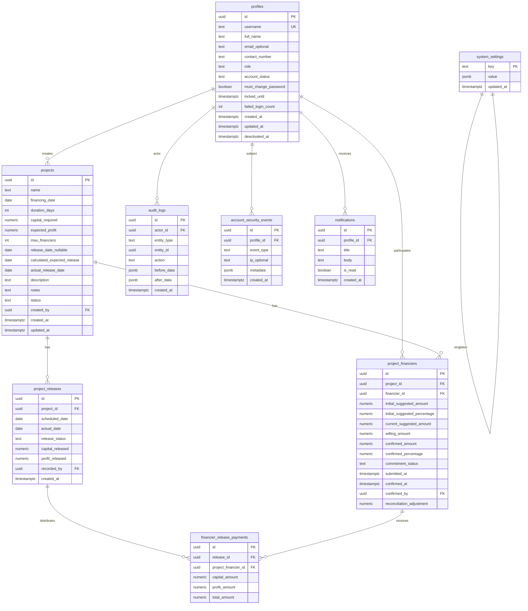

# FundTrack — Database Design

## Document Control

| Field | Value |
| --- | --- |
| Document | `docs/11-database-design.md` |
| Owner | ObraTech |
| Version | 0.1 |
| Last Updated | 2026-07-23 |
| Approval Status | **READY FOR REVIEW** |

## 1. Design Principles

- PostgreSQL via Supabase; money as `NUMERIC(18,2)`.
- Consolidate invitation/willingness/confirmation into `project_financiers` ([ADR-005](../decisions/ADR-005-entity-consolidation.md)).
- Soft deactivate profiles; retain historical financing rows.
- Authoritative math in RPC functions inside transactions.
- No executable SQL in this document — design only.

## 2. Entity Relationship Diagram

## 3. Enumerations (logical)

| Enum | Values |
| --- | --- |
| role | admin, financier |
| account_status | active, inactive, locked |
| project_status | draft, open_for_funding, partially_funded, fully_funded, active, released, completed, overdue, cancelled |
| commitment_status | invited, pending, submitted, confirmed, rejected, withdrawn |
| release_status | tba, scheduled, released, overdue |

## 4. Keys, Constraints, Indexes (intent)

- `profiles.username` unique, stored lowercased.
- Unique `(project_id, financier_id)` on `project_financiers`.
- Check: money ≥ 0; `confirmed_amount` null or ≥ 0; `max_financiers` ≥ 1; `duration_days` ≥ 1.
- Project-level check enforced in RPC: sum(confirmed_amount) ≤ capital_required.
- Indexes: `projects(status)`, `project_financiers(financier_id)`, `project_financiers(project_id, commitment_status)`, `project_releases(scheduled_date)`, `audit_logs(entity_type, entity_id)`, `account_security_events(profile_id, created_at)`.

## 5. Transaction Boundaries

1. **Confirm allocations:** lock project row → validate sums → update rows → set project status → write audit → commit.
2. **Submit willing amount:** validate status allows edit → update willing + status → audit.
3. **Record release:** insert release → compute payments by confirmed % → update project dates/status → audit.
4. **Create financier:** Edge Function Auth create + profile insert (compensate/rollback Auth user on profile failure).

## 6. Soft Delete

- Profiles: `account_status = inactive`, `deactivated_at` set; no hard delete in MVP.
- Projects: `cancelled` status; no hard delete.
- Financing history never purged by deactivation.

## 7. Related Documents

- [docs/12-data-dictionary.md](12-data-dictionary.md)
- [docs/15-row-level-security-plan.md](15-row-level-security-plan.md)
- [docs/07-financial-calculations.md](07-financial-calculations.md)
