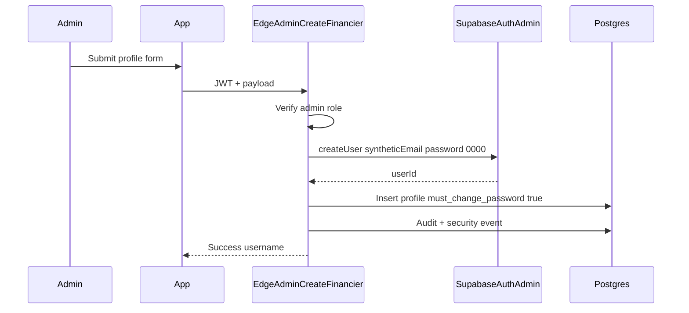

# FundTrack — Authentication Design

## Document Control

| Field | Value |
| --- | --- |
| Document | `docs/13-authentication-design.md` |
| Owner | ObraTech |
| Version | 0.1 |
| Last Updated | 2026-07-23 |
| Approval Status | **READY FOR REVIEW** |

## 1. Goals

- Username + password UX for admin and financier.
- Passwords handled only by Supabase Auth (hashed); never stored in app tables or returned to clients.
- Temporary password `0000` with mandatory change.
- Privileged account ops via Edge Functions ([ADR-004](../decisions/ADR-004-edge-function-boundaries.md)).

## 2. Identity Model

Per [ADR-002](../decisions/ADR-002-username-auth-model.md):

- `profiles.username` is the human login identifier.
- Auth email = `{username}@users.fundtrack.local` (synthetic).
- Optional `profiles.email` is contact-only in MVP.

## 3. Create Financier Flow

## 4. Login and Forced Password Change

1. Client maps username → synthetic email.
2. `signInWithPassword`.
3. Load profile; if inactive/locked → deny and message.
4. If `must_change_password` → only `/change-password` allowed.
5. New password must differ from `0000` and meet length policy (document min 8 for MVP implementation).
6. On success: Auth update password; set `must_change_password=false`; security event; proceed to dashboard.

## 5. Admin Password Reset

1. Admin triggers reset on financier.
2. Edge Function sets password to `0000`, `must_change_password=true`.
3. Revoke existing sessions (Auth Admin sign-out / ban refresh as supported).
4. Audit + security event.
5. Admin never sees a “current password.”

## 6. Failed Logins and Locking

- Increment `failed_login_count` on failure (via Edge webhook or secure logging path to be finalized in implementation).
- After N failures (default propose **5**), set `account_status=locked` and `locked_until` (e.g. 15 minutes) or require admin unlock.
- Record `account_security_events`.
- Exact thresholds confirmed in Gate 3 if needed (see open questions).

## 7. Session Rules

- JWT sessions via Supabase client; store per Supabase SSR/SPA guidance (prefer memory + secure refresh handling; avoid putting tokens in localStorage if team adopts safer pattern — document risk in security plan).
- Deactivate account → block login and revoke sessions.
- Role changes require re-fetch of profile claims used by route guards (profile table is source of role).

## 8. Forgot Password (MVP)

- No self-serve email reset (synthetic email).
- Page explains contacting administrator for reset to `0000`.

## 9. Temporary Password Risk (documented)

**Risk:** Shared known temp password `0000` is guessable if username is known before first login.

**Mitigations:** Forced change before any business access; short window accountability; account lockout; admin-only provisioning; audit of resets; TLS; later replace with random one-time passwords (post-MVP recommendation — do not silently change MVP requirement).

## 10. Related Documents

- [docs/14-security-plan.md](14-security-plan.md)
- [docs/04-user-roles-and-permissions.md](04-user-roles-and-permissions.md)
