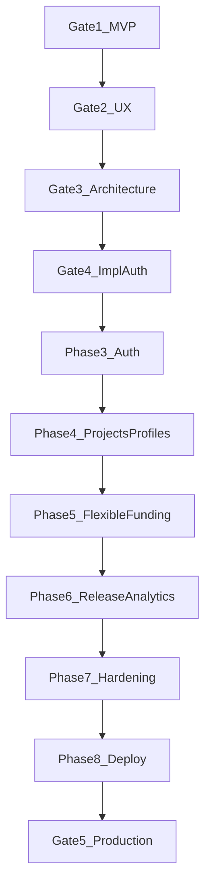

# Dependency Map

## Story dependencies

| Story | Depends on |
| ----- | ---------- |
| US-002 Forced password change | Auth project setup (Phase 3) |
| US-001 Create financier | US-002 patterns; Edge Function create-user |
| US-003 Create project | Admin auth |
| US-004 Invite | US-001, US-003 |
| US-005 Willing amount | US-004 |
| US-006 Confirm allocations | US-005 |
| US-007 Release date | US-003 |
| US-008 Record release | US-006, US-007 |
| US-009 / US-010 Analytics | US-006 (confirmed amounts) |
| US-011 / US-012 Account ops | US-001 |
| US-013 Overdue display | US-007 |

## Technical dependencies

- Vercel SPA ↔ Supabase Auth redirect URL allow-list
- Edge Functions ↔ service role secrets (never in `VITE_*`)
- Confirmation RPC ↔ overfunding check constraints
- Analytics views ↔ confirmed + release tables
